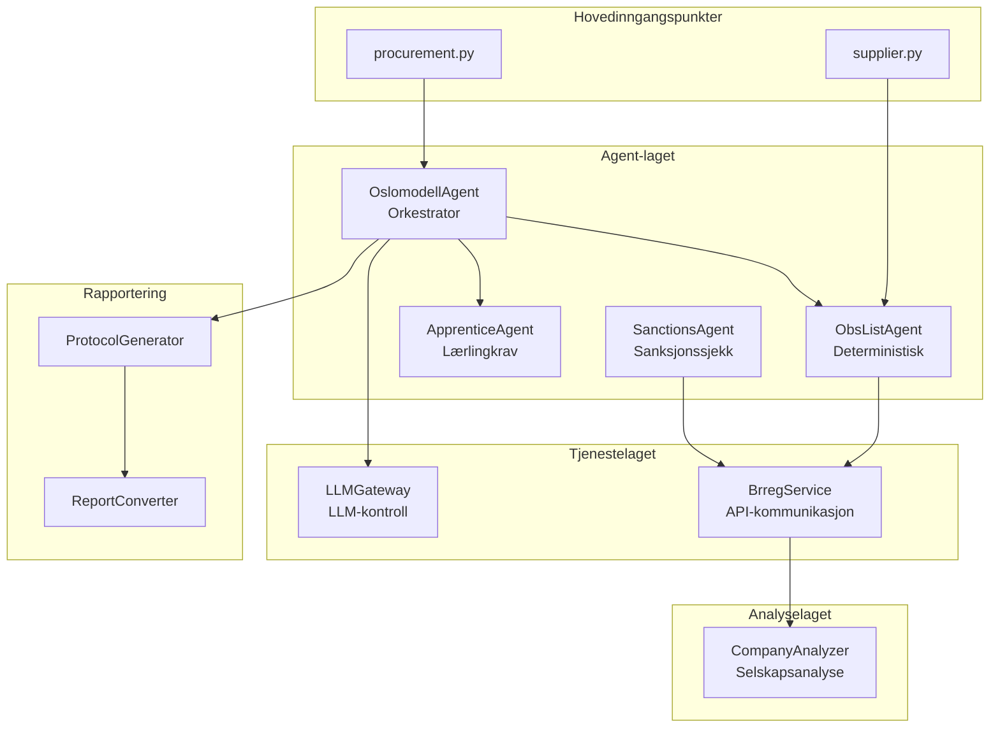
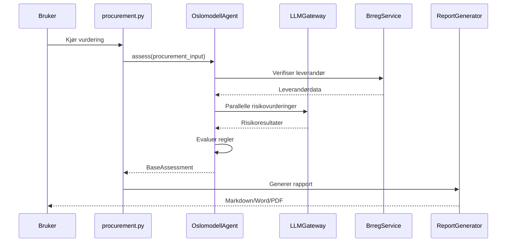

# Oslomodellagenten

Et intelligent verktøy for automatisk vurdering av risiko og regeletterlevelse i offentlige anskaffelser for Oslo kommune. Systemet kombinerer deterministiske regelsjekker med avanserte språkmodeller (LLM) for å gi omfattende vurderinger av både anskaffelser og leverandører.

## 📋 Innholdsfortegnelse

- [Oversikt](#oversikt)
- [Arkitektur](#arkitektur)
- [Hovedkomponenter](#hovedkomponenter)
- [Installasjon](#installasjon)
- [Konfigurasjon](#konfigurasjon)
- [Bruk](#bruk)
- [Dataflyt](#dataflyt)
- [Avhengigheter](#avhengigheter)

## 🎯 Oversikt

Oslomodell Agent består av to hovedinngangspunkter:

1. **`procurement.py`** - Vurderer offentlige anskaffelser mot gjeldende regelverk og identifiserer risikoer
2. **`supplier.py`** - Verifiserer leverandører mot OBS-lister og genererer omfattende selskapsrapporter

Systemet bruker en "Mixture of Experts" (MoE) arkitektur der spesialiserte agenter parallelt vurderer ulike aspekter som menneskerettigheter, korrupsjon, miljørisiko og arbeidslivskriminalitet.

## 🏗️ Arkitektur



### Mappestruktur

```
src/
├── agents/          # Intelligente og deterministiske agenter
├── services/        # Eksterne API-tjenester og LLM-gateway
├── analyzers/       # Dataanalyse og transformasjon
├── models/          # Pydantic datamodeller og enums
├── reporting/       # Rapportgenerering (Markdown, Word, PDF)
└── tools/           # Hjelpeverktøy for sammensatte oppgaver
```

## 🔧 Hovedkomponenter

### OslomodellAgent (`src/agents/oslomodell_agent.py`)

Den sentrale orkestrerende agenten som:
- Laster og evaluerer regler fra en JSON-kunnskapsbase
- Koordinerer parallelle LLM-baserte risikovurderinger via "Mixture of Experts"
- Kjører spesialistagenter for menneskerettigheter, korrupsjon og miljø
- Bruker en synthesis-agent for å generere helhetlige oppsummeringer
- Integrerer deterministiske sjekker (OBS-liste, lærlingkrav)

### LLMGateway (`src/services/llm_gateway.py`)

Et sofistikert kontrollsenter for LLM-interaksjon som håndterer:
- Google Gemini API-integrasjon med støtte for ulike modeller
- Parallell prosessering av multiple forespørsler
- Rate limiting og køhåndtering
- Kostnadsovervåking og tokenbruk
- Strukturerte responser med Pydantic-validering
- Thinking-mode for transparente resonneringsprosesser

### ObsListAgent (`src/agents/obs_list_agent.py`)

En deterministisk agent som:
- Verifiserer leverandører mot Oslo kommunes OBS-liste
- Bruker Brønnøysundregistrene for navnenormalisering
- Håndterer flere treff med interaktiv brukervelger
- Krever ingen LLM-ressurser (rent regelbasert)

### CompanyAnalyzer (`src/analyzers/company_analyzer.py`)

Analyserer selskapsdata og vurderer:
- Finansiell styrke (soliditet, likviditet, resultatgrad)
- Konkursrisiko og avviklingsstatus
- Styrestabilitet og ledelsesstruktur
- Detaljerte regnskapstall

### BrregService (`src/services/brreg_service.py`)

Dataintegrasjonslaget som kommuniserer med:
- Enhetsregisteret (selskapsdetaljer og roller)
- Regnskapsregisteret (finansiell informasjon)
- Fullmakt API (signaturrett og prokura)

## 📦 Installasjon

### Forutsetninger

- Python 3.8 eller høyere
- Pandoc (for PDF/Word-generering)
- En Google Gemini API-nøkkel

### Trinn-for-trinn installasjon

1. Klon repositoriet:
```bash
git clone <repository-url>
cd oslomodell-agent
```

2. Opprett virtuelt miljø:
```bash
python -m venv .venv
source .venv/bin/activate  # På Windows: .venv\Scripts\activate
```

3. Installer avhengigheter:
```bash
pip install -r requirements.txt
```

4. Installer Pandoc for dokumentkonvertering:
```bash
# Ubuntu/Debian
sudo apt-get install pandoc

# macOS
brew install pandoc

# Windows
# Last ned fra https://pandoc.org/installing.html
```

## ⚙️ Konfigurasjon

### 1. Miljøvariabler (.env)

Opprett en `.env` fil i rotmappen:

```env
# Google Gemini API-nøkkel (påkrevd for LLM-funksjonalitet)
GEMINI_API_KEY=your-api-key-here

# Valgfritt: Overstyr standardinnstillinger
LLM_MAX_CONCURRENT=10
LLM_RATE_LIMIT=60
LLM_MAX_THOUGHT_LENGTH=1000
```

### 2. Hovedkonfigurasjon (config/oslomodell_config.yaml)

```yaml
# Kunnskapsbase med regler og krav
knowledge_base:
  file_path: "data/Instruks_oslomodellen_knowledge_20250819_112033.json"

# Eksterne tjenester (Brønnøysundregistrene)
external_services:
  brreg_enhetsregisteret_url: "https://data.brreg.no/enhetsregisteret/api"
  brreg_regnskapsregisteret_url: "https://data.brreg.no/regnskapsregisteret"
  brreg_fullmakt_api_url: "https://data.brreg.no/fullmakt"

# Logging-nivå
logging:
  level: "INFO"  # DEBUG, INFO, WARNING, ERROR

# Validering av input
validation:
  required_input_fields:
    - "name"
    - "value"
    - "category"
    - "duration_months"
  allowed_categories:
    - "bygg"
    - "anlegg"
    - "vare"
    - "tjeneste"
    - "renhold"

# Selskapsanalyse-terskler
company_analyzer_config:
  financial_thresholds:
    soliditet_prosent:
      kritisk: 0
      svak: 10
      tilfredsstillende: 20
      god: 40
    likviditetsgrad:
      svak: 1.0
      tilfredsstillende: 1.5
      god: 2.0

# Lærling-agent konfigurasjon
apprentice_agent_config:
  threshold_value: 1300000       # Minimum kontraktsverdi
  min_duration_months: 3         # Minimum varighet
  udir_data_file: "data/utdanningsprogram.csv"
  special_need_threshold: 0.90
  llm:
    enabled: false  # Sett til true for å aktivere LLM-analyse

# Menneskerettighets-agent
human_rights_and_law_agent_config:
  enabled: false  # Sett til true for å aktivere
  llm_parameters:
    purpose: "fast_evaluation"
    include_thoughts: false

# Korrupsjons-agent
corruption_agent_config:
  enabled: false  # Sett til true for å aktivere
  llm_parameters:
    purpose: "fast_evaluation"
    include_thoughts: false

# Miljø-agent
environment_agent_config:
  enabled: false  # Sett til true for å aktivere
  llm_parameters:
    purpose: "fast_evaluation"
    include_thoughts: false

# Syntese-agent (sluttoppsummering)
synthesis_agent_config:
  enabled: false  # Sett til true for å aktivere
  llm_parameters:
    purpose: "complex_reasoning"
    include_thoughts: true
```

### 3. LLM-konfigurasjon (config/llm_config.yaml)

Denne filen opprettes automatisk med standardverdier hvis den ikke eksisterer. Se `src/services/llm_gateway.py` for alle tilgjengelige innstillinger.

### 4. Rapportkonfigurasjon (config/protocol_config.yaml)

Styrer utseendet og innholdet i genererte rapporter. Se eksempelfilen for detaljer om tilpasning av titler, seksjonsrekkefølge og kravforklaringer.

## 🚀 Bruk

### Vurdere en anskaffelse

```bash
python procurement.py
```

Dette skriptet vil:
1. Laste konfigurasjonen og kunnskapsbasen
2. Kjøre en testprosessering av en predefinert anskaffelse
3. Utføre parallelle risikovurderinger hvis LLM-agenter er aktivert
4. Generere en detaljert vurderingsrapport
5. Vise resultater i konsollen

### Verifisere en leverandør

```bash
python supplier.py
```

Dette starter en interaktiv dialog hvor du kan:
1. Velge mellom norske og utenlandske leverandører
2. Skrive inn leverandørnavn for verifisering
3. Velge riktig leverandør hvis flere treff
4. Se OBS-liste status
5. Få generert en omfattende selskapsrapport (for norske leverandører)

Eksempel på interaksjon:
```
VELKOMMEN TIL SAMLET LEVERANDØR-VERIFISERING
Velg en handling:
 1. Verifiser en norsk leverandør
 2. Registrer en utenlandsk leverandør
 0. Avslutt
Ditt valg: 1
Skriv inn navnet på den norske leverandøren: Aker
```

## 📊 Dataflyt



## 📚 Avhengigheter

Hovedavhengigheter fra `requirements.txt`:

- **pydantic** (2.11.7) - Datavalidering og strukturering
- **google-genai** (1.31.0) - Google Gemini API-klient
- **httpx** (0.28.1) - Asynkron HTTP-klient
- **structlog** (25.4.0) - Strukturert logging
- **pypandoc** (1.15) - Dokumentkonvertering
- **PyYAML** (6.0.2) - YAML-konfigurasjon
- **python-dotenv** (1.1.1) - Miljøvariabelhåndtering
- **thefuzz** (0.22.1) - Fuzzy string matching

Se `requirements.txt` for komplett liste.

Datafiler er ikke offentlig tilgjengelig.

## 📝 Lisens

Dette prosjektet er utviklet av Kasper Holter Johns. Bruk forutsetter skriftlig samtykke, med unntak av personlig bruk.
