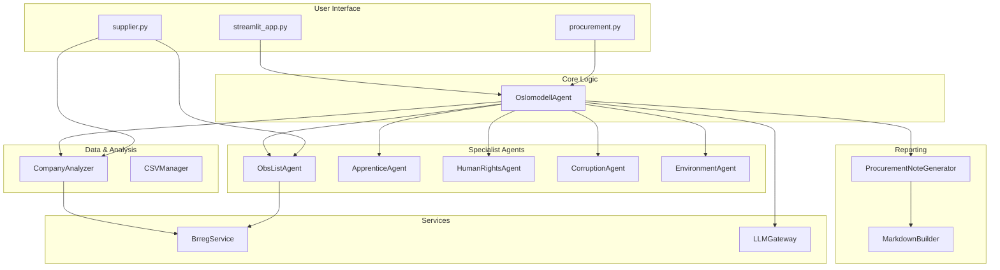
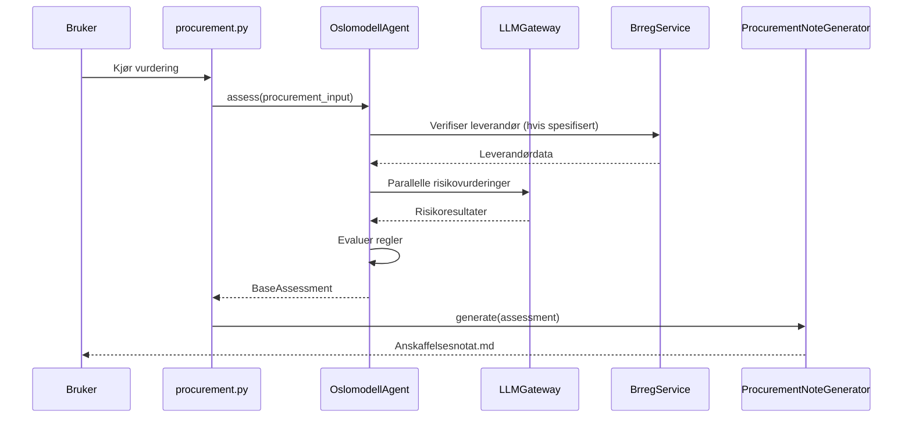

# Oslomodellagenten

Et intelligent verktøy for automatisk vurdering av risiko og regeletterlevelse i offentlige anskaffelser for Oslo kommune. Systemet kombinerer deterministiske regelsjekker med avanserte språkmodeller (LLM) for å gi omfattende vurderinger av både anskaffelser og leverandører.

## 📋 Innholdsfortegnelse

- [Oversikt](#oversikt)
- [Arkitektur](#arkitektur)
- [Hovedkomponenter](#hovedkomponenter)
- [Installasjon](#installasjon)
- [Konfigurasjon](#konfigurasjon)
- [Bruk](#bruk)
- [Dataflyt](#dataflyt)
- [Avhengigheter](#avhengigheter)

## 🎯 Oversikt

Oslomodell Agent består av tre hovedinngangspunkter:

1.  **`procurement.py`** - Vurderer offentlige anskaffelser mot gjeldende regelverk og identifiserer risikoer.
2.  **`supplier.py`** - Verifiserer leverandører mot OBS-lister og genererer omfattende selskapsrapporter.
3.  **`streamlit_app.py`** - Et web-basert brukergrensesnitt for interaktiv vurdering og rapportering.

Systemet bruker en "Mixture of Experts" (MoE) arkitektur der spesialiserte agenter parallelt vurderer ulike aspekter som menneskerettigheter, korrupsjon, miljørisiko og arbeidslivskriminalitet.

## 🏗️ Arkitektur



### Mappestruktur

```
src/
├── agents/          # Intelligente og deterministiske agenter
├── services/        # Eksterne API-tjenester og LLM-gateway
├── analyzers/       # Dataanalyse og transformasjon
├── models/          # Pydantic datamodeller og enums
├── generators/      # Rapport- og notatgeneratorer
├── builders/        # Hjelpeklasser for å bygge komplekse objekter
└── utils/           # Diverse hjelpeverktøy (f.eks. CSVManager)
```

## 🔧 Hovedkomponenter

### OslomodellAgent (`src/agents/oslomodell_agent.py`)

Den sentrale orkestrerende agenten som:
- Laster og evaluerer regler fra en JSON-kunnskapsbase.
- Koordinerer parallelle LLM-baserte risikovurderinger.
- Kjører spesialistagenter for menneskerettigheter, korrupsjon og miljø.
- Integrerer deterministiske sjekker (OBS-liste, lærlingkrav).
- Logger detaljerte resultater til CSV-filer for sporbarhet.

### LLMGateway (`src/services/llm_gateway.py`)

Kontrollsenter for LLM-interaksjon som håndterer:
- Google Gemini API-integrasjon.
- Parallell prosessering av forespørsler.
- Rate limiting og køhåndtering.
- Kostnadsovervåking og logging av tokenbruk.
- Strukturerte responser med Pydantic-validering.

### ProcurementNoteGenerator (`src/generators/procurement_note_generator.py`)

Ansvarlig for å generere komplette anskaffelsesnotater i Markdown-format, basert på YAML-templates og resultatene fra agent-vurderingen.

### CompanyAnalyzer (`src/analyzers/company_analyzer.py`)

Analyserer selskapsdata fra Brønnøysundregistrene og vurderer:
- Finansiell styrke (soliditet, likviditet, resultatgrad).
- Konkursrisiko og avviklingsstatus.
- Styrestabilitet.

### CSVManager (`src/utils/csv_manager.py`)

Håndterer all lesing og skriving til CSV-filer på en trådsikker måte. Dette inkluderer logging av vurderinger, kostnader, og verifiseringer.

## 📦 Installasjon

### Forutsetninger

- Python 3.8 eller høyere
- En Google Gemini API-nøkkel

### Trinn-for-trinn installasjon

1.  Klon repositoriet:
    ```bash
    git clone <repository-url>
    cd Oslomodell
    ```

2.  Opprett og aktiver et virtuelt miljø:
    ```bash
    python -m venv .venv
    source .venv/bin/activate  # På Windows: .venv\Scripts\activate
    ```

3.  Installer avhengigheter:
    ```bash
    pip install -r requirements.txt
    ```

## ⚙️ Konfigurasjon

### 1. Miljøvariabler (.env)

Opprett en `.env` fil i rotmappen:

```env
# Google Gemini API-nøkkel (påkrevd for LLM-funksjonalitet)
GEMINI_API_KEY=your-api-key-here
```

### 2. Hovedkonfigurasjon (config/oslomodell_config.yaml)

Denne filen styrer all hovedlogikk, inkludert:
- Aktivering av spesialistagenter (menneskerettigheter, korrupsjon, etc.).
- Terskelverdier for lærlingkrav.
- Konfigurasjon for selskapsanalyse.
- Stier til datakilder og kunnskapsbaser.

## 🚀 Bruk

### Vurdere en anskaffelse (CLI)

```bash
python procurement.py
```

Dette skriptet kjører en serie med forhåndsdefinerte test-anskaffelser, utfører fulle vurderinger, og genererer et anskaffelsesnotat i Markdown-format for hver av dem.

### Verifisere en leverandør (CLI)

```bash
python supplier.py
```

Dette starter en interaktiv dialog for å verifisere en spesifikk leverandør mot OBS-listen og generere en detaljert selskapsrapport.

### Interaktiv Web App

```bash
streamlit run streamlit_app.py
```

Dette starter en web-applikasjon for en mer brukervennlig og interaktiv opplevelse.

## 📊 Dataflyt



## 📚 Avhengigheter

Hovedavhengigheter fra `requirements.txt`:

-   **pydantic** - Datavalidering og strukturering
-   **google-genai** - Google Gemini API-klient
-   **httpx** - Asynkron HTTP-klient
-   **structlog** - Strukturert logging
-   **PyYAML** - YAML-konfigurasjon
-   **streamlit** - For web-applikasjonen

Se `requirements.txt` for komplett liste.

## 📝 Lisens

Dette prosjektet er utviklet av Kasper Holter Johns. Bruk forutsetter skriftlig samtykke, med unntak av personlig bruk.
